# people_relation API仕様書

## 概要
- **API名**: people_relation API
- **実装**: FastAPI
- **バージョン**: 0.1.0（サーバー実装上の値）
- **目的**: Wikipedia由来の人物・関係データの保存、および保存済みデータの検索/取得

## ベースURL
- **開発（docker compose）**: `http://localhost:8080`
- **APIプレフィックス**: `/api`
- **フロントエンド既定**: `VITE_API_BASE_URL` が無ければ `/api`

よって、フロントから叩かれる実URL例は `http://localhost:8080/api/v1/...` です。

### CDN・別オリジンでフロントを配信する場合
- **API の実URL**がフロントのページと **異なるオリジン**になるため、ブラウザは CORS により API へのアクセスを制限します。
- **バックエンド**: 環境変数 `CORS_ORIGINS` に、ユーザーがアクセスする **フロントの origin**（例: `https://cdn.example.com`）をカンマ区切りで追加してください。認証クッキーを使わない通常の `fetch` でも、`Access-Control-Allow-Origin` が必要です。
- **フロント（ビルド時）**: `VITE_API_BASE_URL` に API のベース（`/api` 相当までの絶対URL）を設定して静的ビルドします。例: `https://api.example.com/api` → 実リクエストは `https://api.example.com/api/v1/...`。
- **フロント（実行時・任意）**: 同一ビルド成果物を複数環境に置く場合、`index.html` 内で `main.tsx` より **前**に  
  `window.__PEOPLE_RELATION__ = { apiBaseUrl: "https://api.example.com/api" };`  
  を注入すると、`VITE_API_BASE_URL` より優先してベースURLが決まります。

## 共通仕様
### リクエスト/レスポンス形式
- **Content-Type**: JSON（POSTは `application/json`）
- **文字コード**: UTF-8

### エラー形式
FastAPI標準のエラー応答を返します。

- **例（404）**:

```json
{ "detail": "person not found" }
```

- **例（422: Validation Error）**: クエリ/ボディのバリデーション不一致（`min_length` や型など）

### 制約
- `name` / `title` / `url` はトリム前提で扱われます（URLは保存時に `strip()` 正規化）。
- 人物は `url` をユニークキーとして upsert されます。
- 関係は `(master_person_id, slave_person_id)` をユニークキーとして upsert されます。

## データ型（スキーマ）
### Person
|フィールド|型|必須|説明|
|---|---|---:|---|
|id|number|yes|人物ID（DBの採番）|
|name|string|yes|人物名|
|title|string|yes|Wikipedia上の表示名（無い場合は `name` が入る）|
|url|string|yes|WikipediaページURL（ユニーク）|

### RelationIn（保存リクエスト用）
|フィールド|型|必須|説明|
|---|---|---:|---|
|master|object|yes|主体者（PersonIn）|
|slave|object|yes|関連者（PersonIn）|
|point|number|yes|出現回数などのスコア（0以上）|

### PersonIn
|フィールド|型|必須|説明|
|---|---|---:|---|
|name|string|yes|人物名|
|url|string|yes|WikipediaページURL|
|title|string|null可|Wikipedia上の表示名（未指定可）|

### RelationOut
|フィールド|型|必須|説明|
|---|---|---:|---|
|master|Person|yes|主体者|
|slave|Person|yes|関連者|
|point|number|yes|スコア|

### RelationAggregateOut
|フィールド|型|必須|説明|
|---|---|---:|---|
|master|Person|yes|主体者|
|slave|Person|yes|関連者|
|forward_point|number|yes|`master -> slave` の point|
|reverse_point|number|yes|`slave -> master` の point（無ければ0）|
|total_point|number|yes|`forward_point + reverse_point`|

### PersonSearchOut
|フィールド|型|必須|説明|
|---|---|---:|---|
|id|number|yes|人物ID|
|name|string|yes|人物名|
|title|string|yes|表示名|
|url|string|yes|WikipediaページURL|
|has_relations|boolean|yes|関係データが1件以上あるか|

### WikiHuman
|フィールド|型|必須|説明|
|---|---|---:|---|
|title|string|yes|入力タイトル（trim後）|
|qid|string|null可|WikidataのQID（取得できない場合null）|
|is_human|boolean|yes|人物（Wikidata: instance of human(Q5)）ならtrue|
|source|string|yes|`cache` / `live` / `unknown`|

## エンドポイント一覧
### 1) ヘルスチェック（素のパス）
`GET /health`

- **用途**: プロセス生存確認（APIプレフィックス無し）
- **レスポンス 200**:

```json
{ "ok": true }
```

#### 通信シーケンス

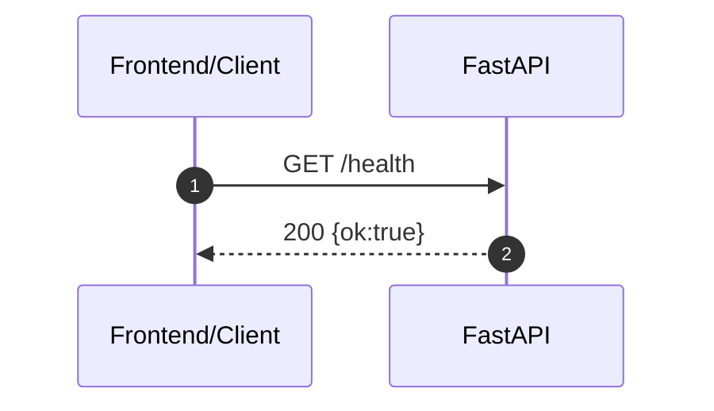

### 2) ヘルスチェック（/api互換）
`GET /api/health`

- **用途**: nginx配下などで `/api/health` を叩くための互換エンドポイント
- **レスポンス 200**:

```json
{ "ok": true }
```

#### 通信シーケンス

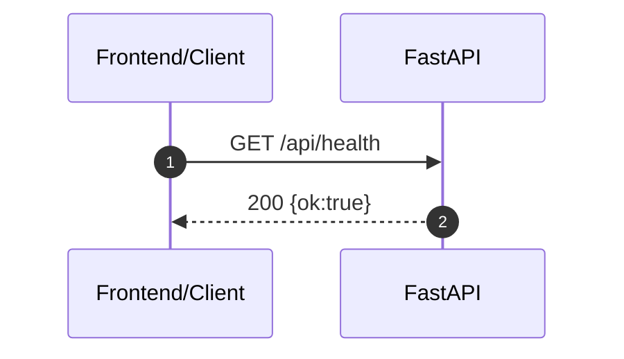

### 3) 関係データの保存（upsert）
`POST /api/v1/relation`

- **用途**: 関係（主体者→関連者）の point を保存（人物/関係ともに upsert）
- **Content-Type**: `application/json`

#### クエリパラメータ
- **`executed_master_url`**（任意）: フロントが Wikipedia 抽出の「主体者」の URL を渡す。値が一致する **person が既に DB にいるときのみ**、保存ループの前に次を実行する。
  1. その人物を **master** とする `relation` 行を **すべて DELETE**
  2. 直前の forward でその主体が **slave** だった逆向き（旧 slave → 主体）の `relation` 行だけ DELETE（再実行で付け替わった関連の reverse を掃除するため）
  3. その後、ペイロードどおりに upsert（新しい `relation.id` が振られる）。**他主体が master の関係**（他人が主体として保存した行）は触れない。

初回登録で person がまだ無い場合は DELETE はスキップされる。

#### リクエストボディ
`RelationIn[]`

```json
[
  {
    "master": {
      "name": "木村拓哉",
      "url": "https://ja.wikipedia.org/wiki/%E6%9C%A8%E6%9D%91%E6%8B%93%E5%93%89",
      "title": "木村 拓哉"
    },
    "slave": {
      "name": "中居正広",
      "url": "https://ja.wikipedia.org/wiki/%E4%B8%AD%E5%B1%85%E6%AD%A3%E5%BA%83",
      "title": "中居 正広"
    },
    "point": 10
  }
]
```

#### レスポンス 200
`RelationOut[]`

```json
[
  {
    "master": { "id": 1, "name": "木村拓哉", "title": "木村 拓哉", "url": "https://ja.wikipedia.org/wiki/%E6%9C%A8%E6%9D%91%E6%8B%93%E5%93%89" },
    "slave": { "id": 2, "name": "中居正広", "title": "中居 正広", "url": "https://ja.wikipedia.org/wiki/%E4%B8%AD%E5%B1%85%E6%AD%A3%E5%BA%83" },
    "point": 10
  }
]
```

#### エラー
- **422**: `point < 0`、必須フィールド欠落、型不一致など

#### 通信シーケンス（DB upsert）

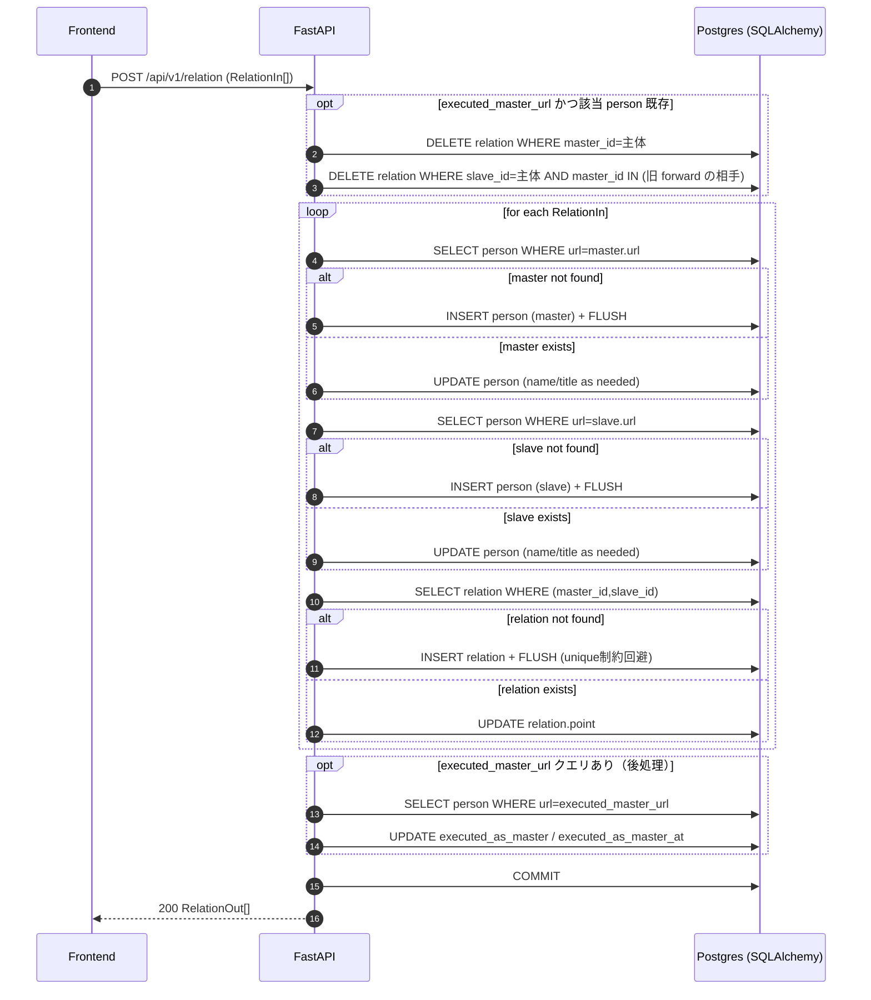

### 4) 人物検索（保存済み）
`GET /api/v1/person/search?name=...`

- **用途**: 保存済み人物の部分一致検索
- **クエリ**
  - `name` (string, 必須, min_length=1)
- **上限**: 20件

#### レスポンス 200
`PersonSearchOut[]`

```json
[
  {
    "id": 1,
    "name": "木村拓哉",
    "title": "木村 拓哉",
    "url": "https://ja.wikipedia.org/wiki/%E6%9C%A8%E6%9D%91%E6%8B%93%E5%93%89",
    "has_relations": true
  }
]
```

#### エラー
- **422**: `name` 未指定/空文字など

#### 通信シーケンス（DB検索）

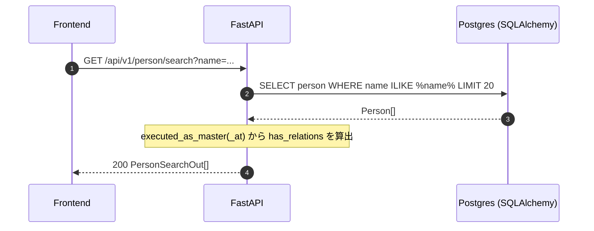

### 5) 関係取得（主体者→関連者）
`GET /api/v1/person/{person_id}/relations`

- **用途**: 指定人物（主体者）に対する関連者リストを取得
- **パスパラメータ**
  - `person_id` (number, 必須)
- **上限**: 50件（`point` 降順、同値は `id` 昇順）

#### レスポンス 200
`RelationOut[]`

```json
[
  {
    "master": { "id": 1, "name": "木村拓哉", "title": "木村 拓哉", "url": "..." },
    "slave": { "id": 2, "name": "中居正広", "title": "中居 正広", "url": "..." },
    "point": 10
  }
]
```

#### エラー
- **404**: `person_id` が存在しない
- **422**: `person_id` の型不正など

#### 通信シーケンス（DB取得）

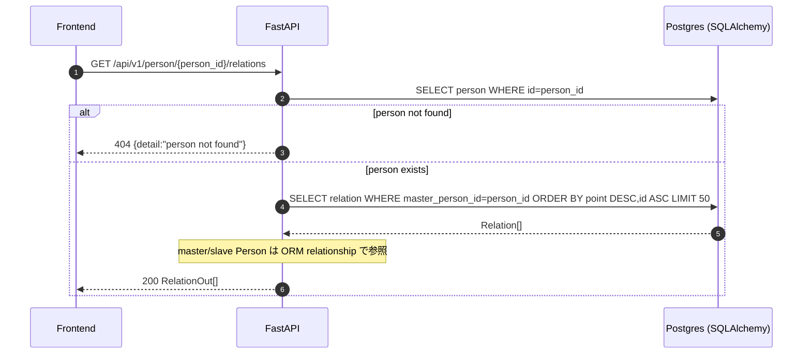

### 6) 関係集計取得（双方向合算）
`GET /api/v1/person/{person_id}/relations_aggregate`

- **用途**: `master -> slave` の point に `slave -> master` を合算した集計を返す
- **パスパラメータ**
  - `person_id` (number, 必須)
- **上限**: 50件（内部的には forward の `point` 降順で取得後、`total_point` 降順にソート）

#### レスポンス 200
`RelationAggregateOut[]`

```json
[
  {
    "master": { "id": 1, "name": "木村拓哉", "title": "木村 拓哉", "url": "..." },
    "slave": { "id": 2, "name": "中居正広", "title": "中居 正広", "url": "..." },
    "forward_point": 10,
    "reverse_point": 8,
    "total_point": 18
  }
]
```

#### エラー
- **404**: `person_id` が存在しない
- **422**: `person_id` の型不正など

#### 通信シーケンス（forward + reverse 外部結合）

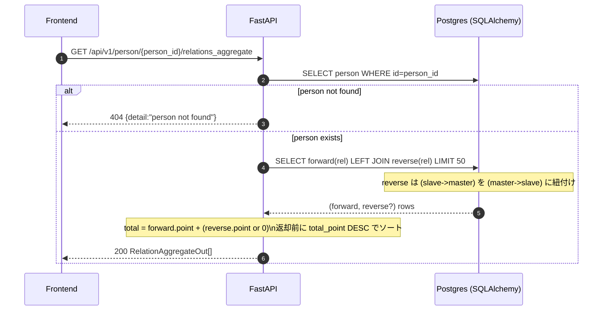

### 7) Wikipediaタイトルの人物判定（Wikidata）
`GET /api/v1/wiki/is_human?title=...`

- **用途**: Wikidataの `instance of (P31)` が `human (Q5)` かで人物判定
- **クエリ**
  - `title` (string, 必須, min_length=1)
- **キャッシュ**: Redis（タイトル単位）
- **補足**: Wikipedia/Wikidata 側の一時的なエラー時は `source="unknown"` で返すが、**Redis には書かない**（`is_human:false` を短TTLでキャッシュすると、再取得時に `source=cache` となりフロントが「判定不能なのに非人物」と誤って固定除外しやすいため）。なおフロントは `source="unknown"`（判定不能）を **表示しない** 扱いにして、人物以外の混入を避ける。

#### 通信シーケンス（Wikipedia/Wikidata + Redis）

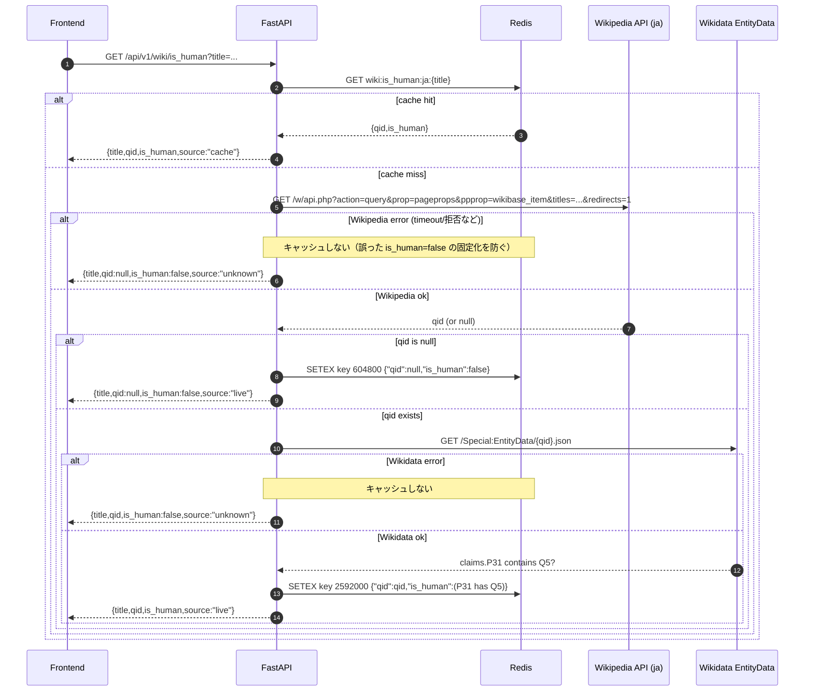

#### レスポンス 200
`WikiHuman`

```json
{
  "title": "木村拓哉",
  "qid": "Q12345",
  "is_human": true,
  "source": "cache"
}
```

#### エラー
- **422**: `title` 未指定/空文字など

## フロントエンドからWikipediaへ直接アクセスする処理

本プロジェクトはバックエンドAPIに加えて、フロントエンドが **Wikipedia API（`https://ja.wikipedia.org/w/api.php`）** を直接呼び出す処理を持ちます（`frontend/src/lib/wiki/*`）。

### A) Wikipedia人物検索（フロント直叩き）

- **呼び出し元**: `wikiSearchPeople()` / `wikiSearchPeopleIncludingExact()`
- **外部API**: Wikipedia API `action=query&list=search`（対応 wiki では `srwhat=title` を付与してタイトル寄りに検索）
- **補足**: **日本語版 Wikipedia では `srwhat=title` が無効**（レスポンス `search-title-disabled`）な場合がある。そのときは **`srwhat` なし**で同じ `srsearch` を再実行する。

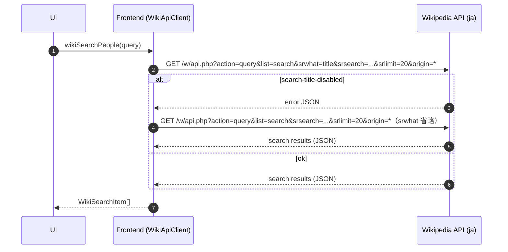

### A-補) 曖昧さ回避ページから候補を展開（フロント直叩き）

- **呼び出し元**: 検索直後の Q5 人物フィルタで候補が 0 件になったとき `expandWikiResultsResolvingDisambiguationPages()`
- **外部API**: Wikipedia API `action=query&prop=pageprops&ppprop=disambiguation&titles=...`（曖昧さ回避の判定）および `action=parse`（hatnote 内リンク抽出・既存 `fetchHatnoteNs0LinkSets`）
- **目的**: 曖昧さ回避ページは Wikidata 上 `instance of human (Q5)` ではないため `GET /api/v1/wiki/is_human` で弾かれやすい。冒頭の hatnote から実人物記事タイトルを解決し、検索候補に合流させてから再度人物判定する。

### B) タイトルの厳密一致確認（フロント直叩き）

- **呼び出し元**: `wikiSearchPeopleIncludingExact()`
- **外部API**: Wikipedia API `action=query&titles=...&redirects=1`

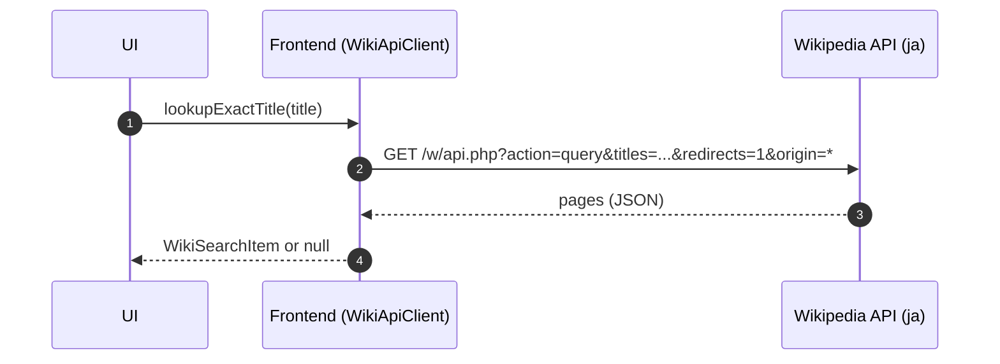

### C) 2-hop 関連者抽出（フロント直叩き + バックエンド人物判定）

- **呼び出し元**: `extractRelationsTwoHop()`
- **外部API（Wikipedia）**: `action=query`（extracts/info/redirects）と `action=parse`（text/wikitext。ns0 リンクは `prop=links` ではなくノイズ節除去後の HTML から抽出）
- **補足**: Wikipedia/Wikidataへの過剰連打を避けるため、フロント側で **最小間隔（既定150ms）+ 429/503/504時リトライ** を行う（`ExternalApiFetcher`）。
- **人物判定**: 候補の一部はバックエンド `GET /api/v1/wiki/is_human` を呼び出して判定（結果はバックエンド側でRedisキャッシュ）。
- **「脚注」「外部リンク」節・カテゴリ・navbox の除外**: 抽出・共起カウント・hatnote 用リンク集合のノイズを減らすため、`action=parse` の HTML から **`<section aria-labelledby="脚注">` / `<section aria-labelledby="外部リンク">`（実ページ相当）**、および **`h2#脚注` / `h2#外部リンク` の見出しブロックから次の `mw-heading2` または最初の `navbox` / パーサレポート手前**までを除去する。続けて **`class` にトークン `navbox` を含む `<div>` / `<table>`**（`navbox-inner` のみのクラスは対象外）をネスト対応ですべて除去し、**`{{キングレコード}}` 等のナビゲーションに由来する同僚歌手リンク**を参照対象から外す。**`id="catlinks"`（カテゴリ表示ブロック）**はネストした `<div>` ごと除去する（API レスポンスに含まれる場合のみ）。**本文中の `[[記事名#脚注|…]]` / `[[記事名#外部リンク|…]]` および `href="/wiki/記事名#脚注"` 形式の節リンク**は、当該記事の脚注・外部リンクブロックへのジャンプであることが多いため、wikitext の `[[...]]` カウントおよびノイズ除去後 HTML からの ns0 リンク抽出からも除外する。`prop=extracts` のプレーン本文は、**`脚注` 見出し行から次のよくある見出し（注釈・出典・参考文献・外部リンク等）の直前まで**、および末尾の **`外部リンク` 見出し行以降**を除去する。wikitext の `[[...]]` カウントでは、`== 脚注 ==` / `== 外部リンク ==` から **次のレベル2見出し**、または **`{{Navboxes`** / **空行のあとの `{{`**（`\n\n{{`）、**`{{Normdaten}}`**、**`[[Category:`** 等の直前までを除去する。

#### C-1) 主体者ページ取得（並列）

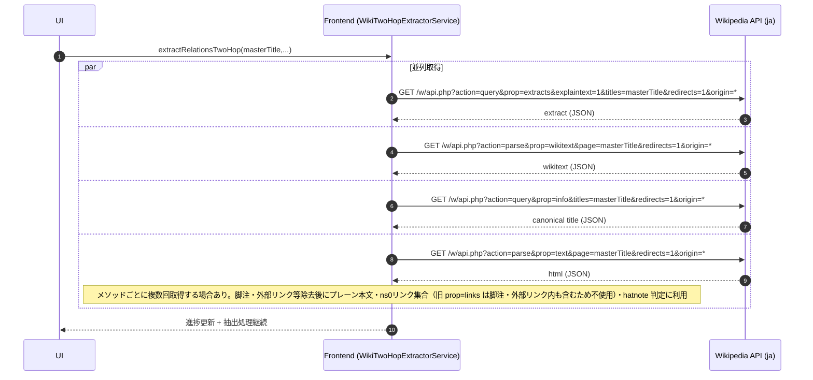

#### C-2) 候補ページの存在確認（必要時）

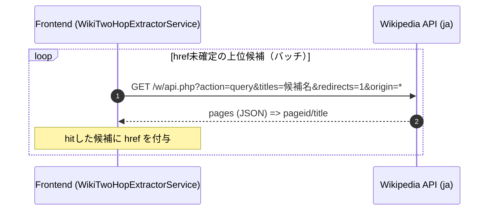

#### C-3) 人物判定（候補の一部）

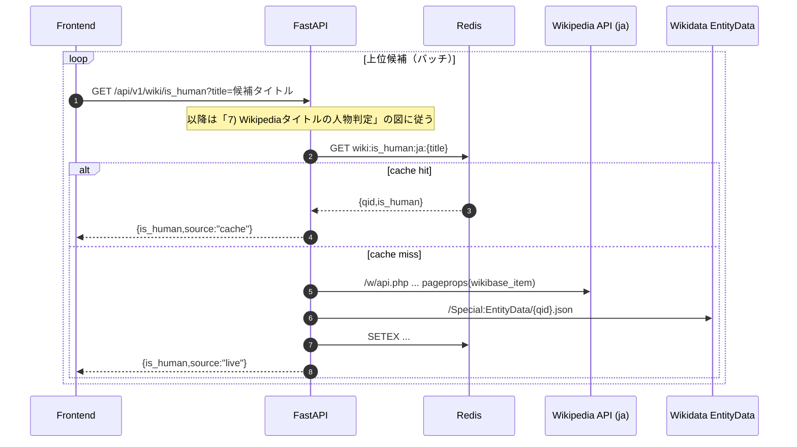

#### C-4) 逆参照（関連者ページを追加取得して reversePoint 算出）

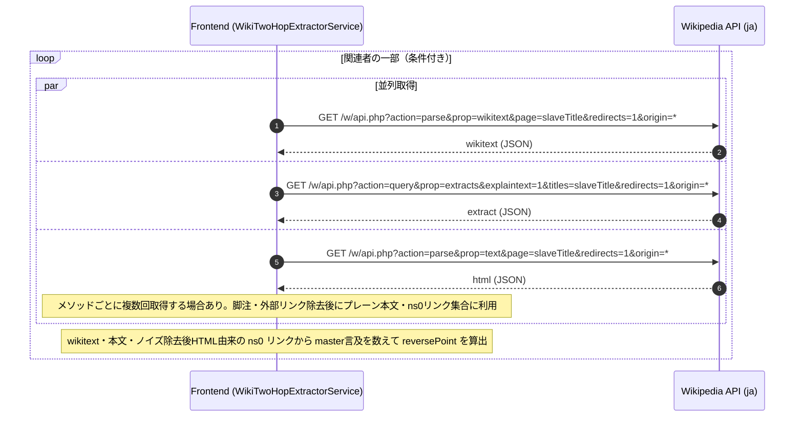

## 変更履歴
- 2026-05-09: `POST /api/v1/relation` で `executed_master_url` 指定時、保存前に当該主体の forward と関連 reverse を削除してから upsert（同一主体で Wikipedia 再実行したときの旧関連を残さない）
- 2026-05-09: parse HTML から `class` に `navbox` を含むブロックを除去（外部リンク直下のレーベルnavboxに含まれる名前リンクの混入防止）。wikitext は外部リンク節の終端境界を `{{Navboxes` 以外（`\n\n{{`・Normdaten・Category 等）にも拡張
- 2026-05-09: parse HTML から `id="catlinks"`（カテゴリリンクブロック）を除去して参照・リンク抽出の対象外にする
- 2026-05-09: Wikipedia の ns0 リンク集合を `prop=links` ではなくノイズ節除去後の parse HTML から抽出するよう変更（脚注・外部リンク由来リンクの混入防止）
- 2026-05-09: CDN/別オリジン配信向け（`CORS_ORIGINS`・`VITE_API_BASE_URL`・実行時 `window.__PEOPLE_RELATION__`）を追記
- 2026-05-08: 初版作成（現行実装に基づく）

