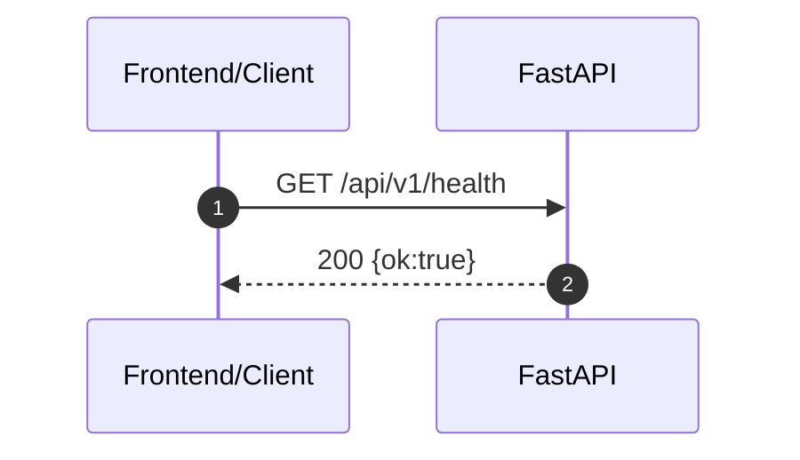
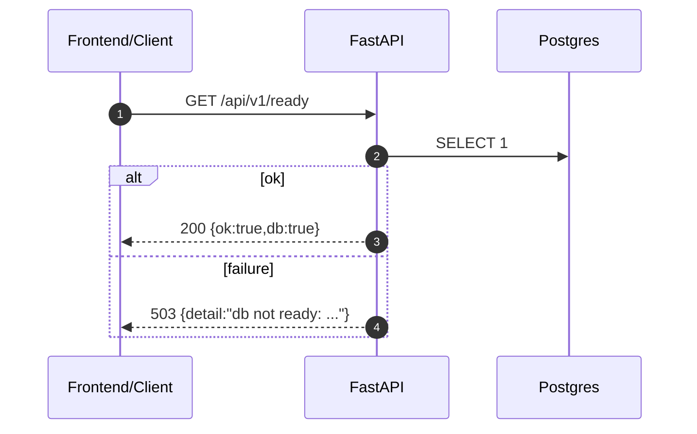
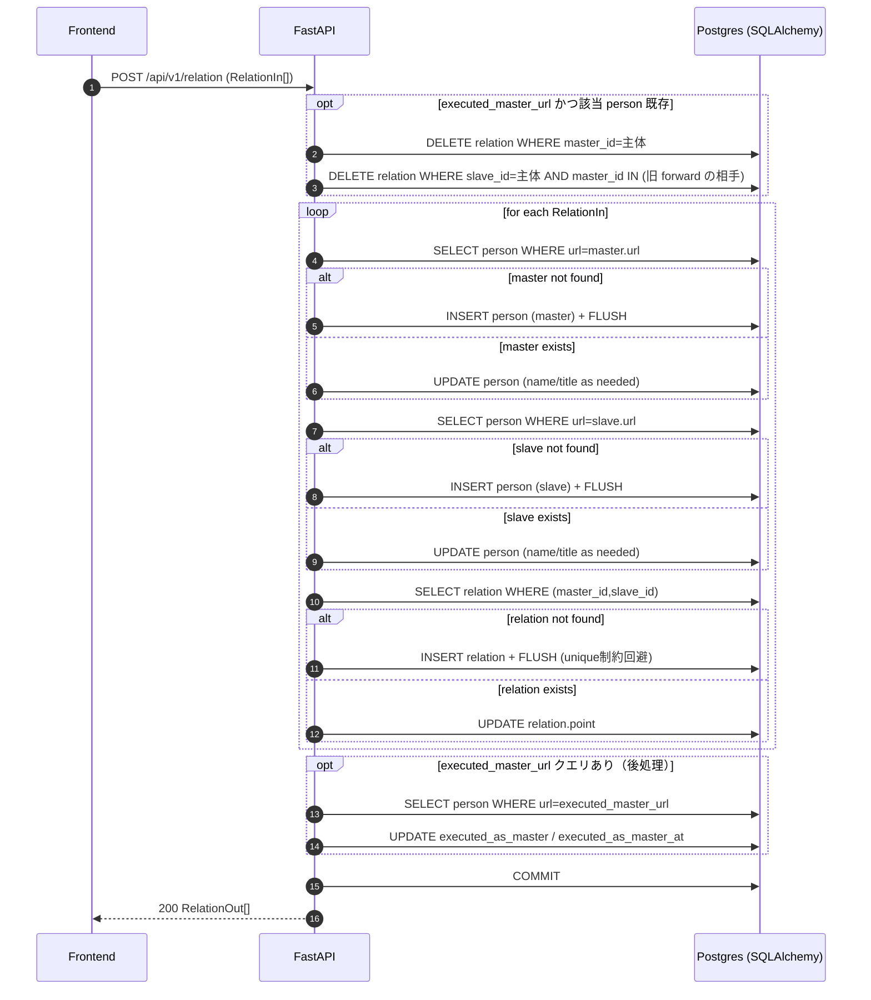
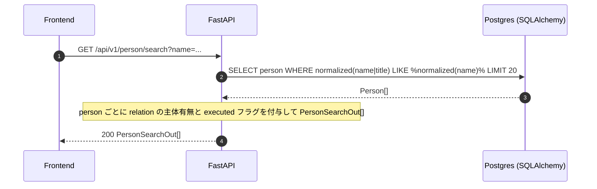
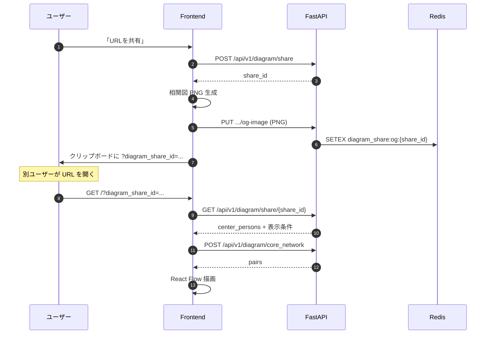
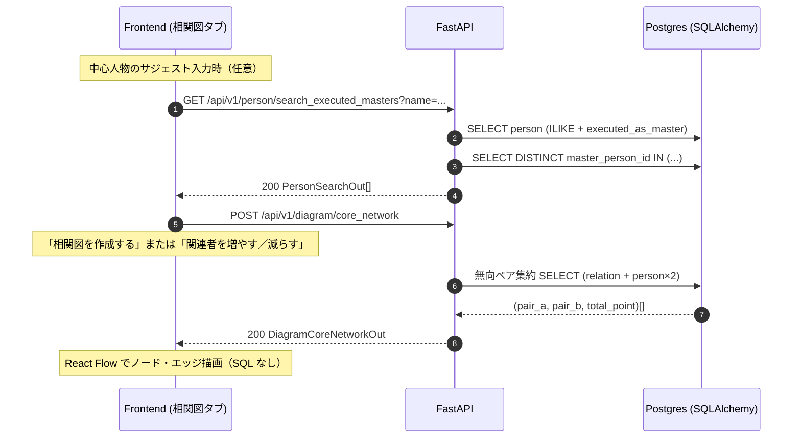
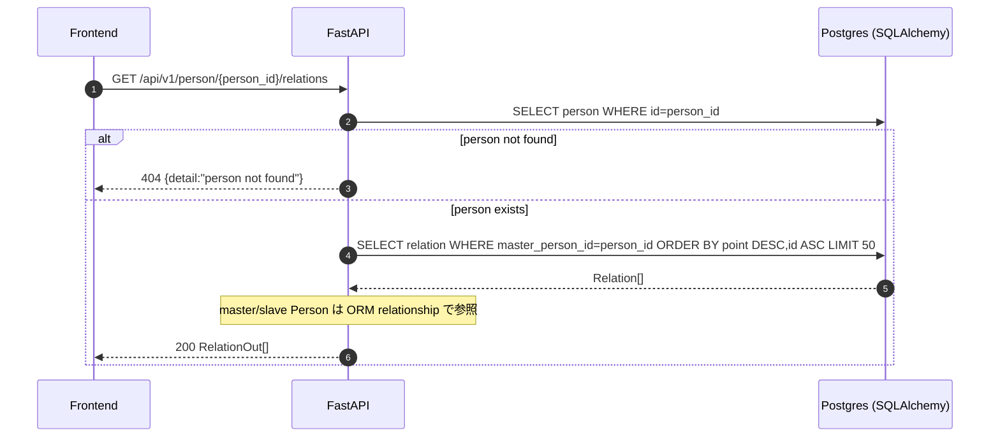
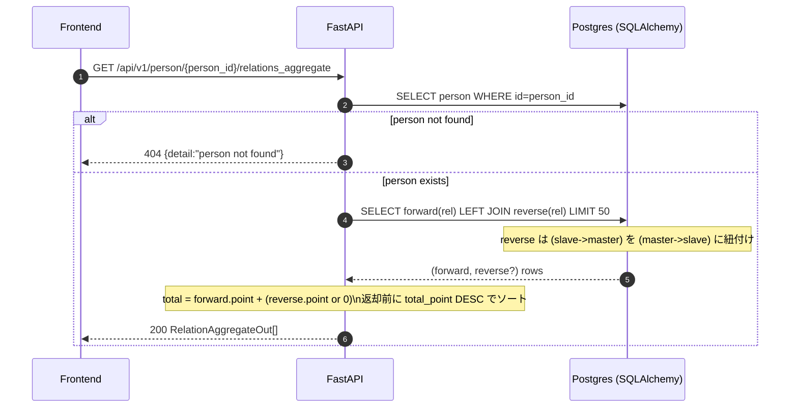
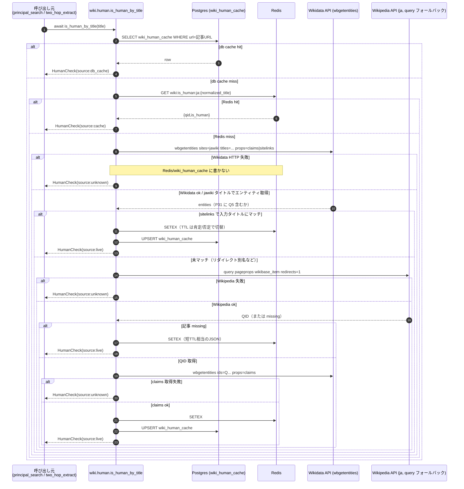
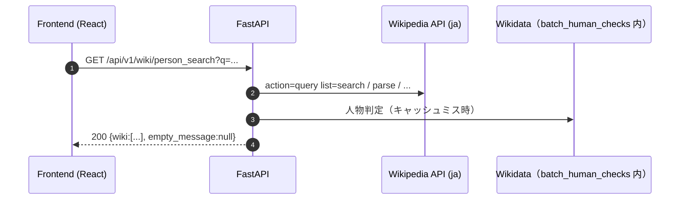

# people_relation API仕様書

## 概要

- **API名**: people_relation API
- **実装**: FastAPI
- **バージョン**: 0.1.0（サーバー実装上の値）
- **目的**: Wikipedia由来の人物・関係データの保存、および保存済みデータの検索/取得
- **Wikipedia / Wikidata**: ブラウザからの直接呼び出しは行わず、**バックエンド**が MediaWiki API と Wikidata Action API（主に `wbgetentities`）を利用する。公開 HTTP の Wikipedia 連携は **`GET /api/v1/wiki/person_search`**（JSON）のみ。2-hop 関連抽出は **`app.worker.relation_extract`** が `app.services.related_search` 経由で実行する（HTTP エンドポイントは無い）。人物判定は **`app.services.wiki.human.is_human_by_title`** および **`batch_human_checks_with_db_redis_priority`** を内部から呼び出す（公開 REST の人物判定エンドポイントは無い）。

## ベースURL

- **開発（docker compose）**: `http://localhost:8080`
- **APIプレフィックス**: `/api`
- **フロントエンド既定**: `VITE_API_BASE_URL` が無ければ `/api`

よって、フロントから叩かれる実URL例は `http://localhost:8080/api/v1/...` です。

### CDN・別オリジンでフロントを配信する場合

- **API の実URL**がフロントのページと **異なるオリジン**になるため、ブラウザは CORS により API へのアクセスを制限します。
- **バックエンド**: 環境変数 `CORS_ORIGINS` に、ユーザーがアクセスする **フロントの origin**（例: `https://cdn.example.com`）をカンマ区切りで追加してください。認証クッキーを使わない通常の `fetch` でも、`Access-Control-Allow-Origin` が必要です。
- **Wikipedia / Wikidata への outgoing HTTP**: 環境変数 **`WIKIPEDIA_USER_AGENT`**（設定フィールド `wikipedia_user_agent`）で User-Agent を上書きできる。本番では **`localhost` を含めない**公式URL・連絡先を含めることを推奨（[Wikimedia のポリシー](https://foundation.wikimedia.org/wiki/Policy:User-Agent_policy) に準拠）。
- **フロント（ビルド時）**: `VITE_API_BASE_URL` に API のベース（`/api` 相当までの絶対URL）を設定して静的ビルドします。例: `https://api.example.com/api` → 実リクエストは `https://api.example.com/api/v1/...`。
- **フロント（実行時・任意）**: 同一ビルド成果物を複数環境に置く場合、`index.html` 内で `main.tsx` より **前**に  
`window.__PEOPLE_RELATION__ = { apiBaseUrl: "https://api.example.com/api" };`  
を注入すると、`VITE_API_BASE_URL` より優先してベースURLが決まります。

## 共通仕様

### リクエスト/レスポンス形式

- **Content-Type**: JSON（POSTは `application/json`）
- **文字コード**: UTF-8

### エラー形式

FastAPI標準のエラー応答を返します。

- **例（404）**:

```json
{ "detail": "person not found" }
```

- **例（422: Validation Error）**: クエリ/ボディのバリデーション不一致（`min_length` や型など）

### 制約

- `name` / `title` / `url` はトリム前提で扱われます（URLは保存時に `strip()` 正規化）。
- 人物は `url` をユニークキーとして upsert されます。
- 関係は `(master_person_id, slave_person_id)` をユニークキーとして upsert されます。

## データ型（スキーマ）

### Person


| フィールド | 型      | 必須  | 説明                               |
| ----- | ------ | --- | -------------------------------- |
| id    | number | yes | 人物ID（DBの採番）                      |
| name  | string | yes | 人物名                              |
| title | string | yes | Wikipedia上の表示名（無い場合は `name` が入る） |
| url   | string | yes | WikipediaページURL（ユニーク）            |

> 補足: `person` テーブルからは `qid` / `wikidata_is_human` を廃止しました。Wikipedia/Wikidata の人物判定結果は別の `wiki_human_cache` テーブルにキャッシュされます（`person` には人物以外を書き込まない）。


### RelationIn（保存リクエスト用）


| フィールド  | 型      | 必須  | 説明              |
| ------ | ------ | --- | --------------- |
| master | object | yes | 主体者（PersonIn）   |
| slave  | object | yes | 関連者（PersonIn）   |
| point  | number | yes | 出現回数などのスコア（0以上） |


### PersonIn


| フィールド | 型      | 必須    | 説明                   |
| ----- | ------ | ----- | -------------------- |
| name  | string | yes   | 人物名                  |
| url   | string | yes   | WikipediaページURL      |
| title | string | null可 | Wikipedia上の表示名（未指定可） |


### Person（レスポンス: PersonOut）


| フィールド | 型       | 必須    | 説明                                      |
| ----- | ------- | ----- | --------------------------------------- |
| id    | number  | yes   | 人物ID                                    |
| name  | string  | yes   | 人物名                                     |
| title | string  | yes   | Wikipedia上のページ表示名                        |
| url   | string  | yes   | WikipediaページURL                         |
| has_relations | boolean | yes | `relation` に当該人物が **主体（`master_person_id`）** として少なくとも 1 行あるとき true |
| is_executed_master | boolean | yes | `person.executed_as_master` が true のとき true（`executed_as_master_at` のみでは true にしない） |
| executed_as_master_at | string (ISO 8601) | null可 | 主体者として関係保存を実行した日時（`person.executed_as_master_at`）。未実行なら null |


### RelationOut


| フィールド  | 型      | 必須  | 説明  |
| ------ | ------ | --- | --- |
| master | Person | yes | 主体者 |
| slave  | Person | yes | 関連者 |
| point  | number | yes | スコア |


### RelationAggregateOut


| フィールド         | 型      | 必須  | 説明                               |
| ------------- | ------ | --- | -------------------------------- |
| master        | Person | yes | 主体者                              |
| slave         | Person | yes | 関連者                              |
| forward_point | number | yes | `master -> slave` の point        |
| reverse_point | number | yes | `slave -> master` の point（無ければ0） |
| total_point   | number | yes | `forward_point + reverse_point`  |


### CoreNetworkIn（相関図エッジ取得リクエスト）

| フィールド | 型 | 必須 | 説明 |
| --- | --- | --- | --- |
| center_titles | string[] | yes | 中心人物の `person.title` を **1〜10件**（重複は除去）。空要素は除去後に件数チェックする。 |
| total_point_gt | int | no | デフォルト `1`。`GROUP BY` 後の条件 `HAVING SUM(relation.point) > total_point_gt`（**0 以上**）。大きいほど表示ペアは厳しくなる。 |

### DiagramRelationPairOut

| フィールド | 型 | 必須 | 説明 |
| --- | --- | --- | --- |
| person1 | string | yes | 無向ペアの辞書順で小さい方の `title`（集約 SQL の `pair_a`） |
| person2 | string | yes | 無向ペアの辞書順で大きい方の `title`（集約 SQL の `pair_b`） |
| total_point | int | yes | 該当する `relation` 行の `point` 合計 |

### DiagramCoreNetworkOut

| フィールド | 型 | 必須 | 説明 |
| --- | --- | --- | --- |
| center_titles | string[] | yes | リクエストで正規化後の中心人物タイトル一覧 |
| pairs | DiagramRelationPairOut[] | yes | 中心に触れてネットワークに入った人物集合内の無向ペアのうち、`SUM(point) > total_point_gt` かつ `point <> 0` を満たすもの（中心—関連者・関連者—関連者を含む、`total_point` 降順） |

### PersonSearchOut


| フィールド         | 型       | 必須  | 説明              |
| ------------- | ------- | --- | --------------- |
| id            | number  | yes | 人物ID            |
| name          | string  | yes | 人物名             |
| title         | string  | yes | 表示名             |
| url           | string  | yes | WikipediaページURL |
| has_relations | boolean | yes | `relation` に当該人物が **主体（`master_person_id`）** として少なくとも 1 行あるとき true |
| is_executed_master | boolean | yes | `person.executed_as_master` が true のとき true（`executed_as_master_at` のみでは true にしない） |
| executed_as_master_at | string (ISO 8601) | null可 | 主体者として実行した日時（未実行なら null） |


### HumanCheck（`is_human_by_title` の戻り値・内部）

`app.services.wiki.human.is_human_by_title` は **`@dataclass` の `HumanCheck`**（`app.schemas`）を返す。`app.services.wiki.extract.principal_search` / `app.services.wiki.extract.two_hop` から await する。**HTTP エンドポイントとしては公開しない**（旧 `GET /api/v1/wiki/is_human` は廃止）。


| フィールド    | 型       | 必須    | 説明                                        |
| -------- | ------- | ----- | ----------------------------------------- |
| title    | string  | yes   | 日本語版記事のページタイトル（リダイレクト解決後の表示名）           |
| qid      | string  | null可 | WikidataのQID（取得できない場合null）                |
| is_human | boolean | yes   | 人物（Wikidata: instance of human(Q5)）ならtrue |
| source   | string  | yes   | `db_cache`（`wiki_human_cache` 命中） / `cache`（Redis 命中） / `live`（API 取得） / `unknown`（取得失敗） |


## エンドポイント一覧

実装（`app.main` + `app.api.v1.router`）上、**すべての API は `/api/v1` 配下**です。ルート直下の `GET /health` や `GET /api/health` は **存在しません**（docker の nginx は `/api/` をバックエンドの `/api/` にそのまま転送する）。

| メソッド | パス | 概要 |
| --- | --- | --- |
| GET | `/api/v1/health` | プロセス生存 |
| GET | `/api/v1/ready` | DB 接続確認 |
| POST | `/api/v1/relation` | 関係の upsert |
| GET | `/api/v1/person/search` | 保存済み人物検索 |
| GET | `/api/v1/person/search_executed_masters` | 主体者実行済み人物のみ検索（相関図の中心人物選定用） |
| POST | `/api/v1/person/resolve_wiki_masters` | Wikipedia 検索各行の記事 URL と DB 上の主体者を一括突合（❷「相関図に追加」用） |
| GET | `/api/v1/person/{person_id}/relations` | 主体→関連（最大50件） |
| GET | `/api/v1/person/{person_id}/relations_aggregate` | 双方向集計（最大50件→total でソート） |
| POST | `/api/v1/diagram/core_network` | 中心人物（1〜10名の title）に基づく無向ペア集約エッジ取得 |
| POST | `/api/v1/diagram/share` | 相関図共有用 `share_id`（暗号化トークン）の発行 |
| GET | `/api/v1/diagram/share/{share_id}` | 共有 ID の復号と中心人物・表示条件の取得 |
| PUT | `/api/v1/diagram/share/{share_id}/og-image` | X / OGP 用相関図 PNG の保存（Redis） |
| GET | `/api/v1/diagram/share/{share_id}/og-image` | 保存済み OGP 画像の配信 |
| GET | `/api/v1/diagram/share/{share_id}/card` | SNS クローラ向け HTML（Twitter Card 等） |
| GET | `/api/v1/wiki/person_search` | Wikipedia 検索 + 人物判定（JSON） |

### 1) ヘルスチェック

`GET /api/v1/health`

- **用途**: プロセス生存確認
- **レスポンス 200**:

```json
{ "ok": true }
```

#### 通信シーケンス



### 2) レディチェック（DB）

`GET /api/v1/ready`

- **用途**: DB に `SELECT 1` が通るか確認（起動待ち・オーケストレーション用）
- **レスポンス 200**:

```json
{ "ok": true, "db": true }
```

- **レスポンス 503**: DB 接続失敗時（`detail` に理由）

#### 通信シーケンス



### 3) 関係データの保存（upsert）

`POST /api/v1/relation`

- **用途**: 関係（主体者→関連者）の point を保存（人物/関係ともに upsert）
- **Content-Type**: `application/json`

- **転送記事（リダイレクト）**: `master` / `slave` の `url` が `https://ja.wikipedia.org/wiki/...` のとき、保存前に MediaWiki API（`action=query&redirects=1`）で正規記事タイトルへ解決し、`person.url` / `person.title` は**転送先の 1 記事**に統一する。転送元→転送先に解決した場合は `person.name`（表示名）も正規タイトルに揃え、リンク元の別名だけが残る事象を防ぐ。転送元タイトル専用の `person` 行は作成しない（同一人物は正規 URL で upsert）。`ja.wikipedia.org` 以外の URL（開発用ダミー等）は従来どおりそのまま保存する。

#### クエリパラメータ

- `executed_master_url`（任意）: フロントが Wikipedia 抽出の「主体者」の URL を渡す。値が一致する **person が既に DB にいるときのみ**、保存ループの前に次を実行する。
  1. その人物を **master** とする `relation` 行を **すべて DELETE**
  2. 直前の forward でその主体が **slave** だった逆向き（旧 slave → 主体）の `relation` 行だけ DELETE（再実行で付け替わった関連の reverse を掃除するため）
  3. その後、ペイロードどおりに upsert（新しい `relation.id` が振られる）。**他主体が master の関係**（他人が主体として保存した行）は触れない。

初回登録で person がまだ無い場合は DELETE はスキップされる。

#### リクエストボディ

`RelationIn[]`

```json
[
  {
    "master": {
      "name": "AAA",
      "url": "https://ja.wikipedia.org/wiki/%E6%9C%A8%E6%9D%91%E6%8B%93%E5%93%89",
      "title": "AAA BBB"
    },
    "slave": {
      "name": "BBB",
      "url": "https://ja.wikipedia.org/wiki/%E4%B8%AD%E5%B1%85%E6%AD%A3%E5%BA%83",
      "title": "CCC DDD"
    },
    "point": 10
  }
]
```

#### レスポンス 200

`RelationOut[]`

```json
[
  {
    "master": {
      "id": 1,
      "name": "AAA",
      "title": "AAA BBB",
      "url": "https://ja.wikipedia.org/wiki/%E6%9C%A8%E6%9D%91%E6%8B%93%E5%93%89",
      "has_relations": true,
      "is_executed_master": true,
      "executed_as_master_at": "2026-05-12T10:00:00"
    },
    "slave": {
      "id": 2,
      "name": "BBB",
      "title": "CCC DDD",
      "url": "https://ja.wikipedia.org/wiki/%E4%B8%AD%E5%B1%85%E6%AD%A3%E5%BA%83",
      "has_relations": true,
      "is_executed_master": false,
      "executed_as_master_at": null
    },
    "point": 10
  }
]
```

`has_relations` は **主体としての `relation` 行の有無**。`is_executed_master` は **`person.executed_as_master` が true かどうか**（`executed_as_master_at` だけでは true にしない）。`executed_as_master_at` は主体者として関係保存を実行した日時の記録（未設定は `null`）。`POST` 直後に主体が更新された場合のみ値が入ることが多い。

#### エラー

- **422**: `point < 0`、必須フィールド欠落、型不一致など

#### 通信シーケンス（DB upsert）




### 4) 人物検索（保存済み）

`GET /api/v1/person/search?name=...`

- **用途**: 保存済み人物の部分一致検索（`person.name` / `person.title`。スペース・中点・ハイフン類は無視して比較）
- **クエリ**
  - `name` (string, 必須, min_length=1)
- **上限**: 20件

#### レスポンス 200

`PersonSearchOut[]`

```json
[
  {
    "id": 1,
    "name": "AAA",
    "title": "AAA BBB",
    "url": "https://ja.wikipedia.org/wiki/%E6%9C%A8%E6%9D%91%E6%8B%93%E5%93%89",
    "has_relations": true,
    "is_executed_master": true,
    "executed_as_master_at": "2026-05-12T10:00:00"
  }
]
```

> 例の整合: 主体として `relation` がある人物は `has_relations: true`。`executed_master_url` 無しで保存のみした場合は `is_executed_master: false` のまま `has_relations: true` になり得る。関連者としてのみ `person` に存在し主体の `relation` が無い場合は `has_relations: false`。

#### エラー

- **422**: `name` 未指定/空文字など

#### 通信シーケンス（DB検索）



### 4-2) 人物検索（主体者実行済みのみ）

`GET /api/v1/person/search_executed_masters?name=...`

- **用途**: **`person.executed_as_master = true`** の人物のみを、`/person/search` と同様の **`name` / `title` 部分一致**（区切り記号除去後）で検索する（❶ 主体者入力のサジェスト・相関図タブの中心人物選定用）。
- **クエリ**
  - `name` (string, 必須, min_length=1)
- **上限**: 20件
- **認証**: なし
- **レスポンス 200**: `PersonSearchOut[]`（スキーマは `GET /api/v1/person/search` と同一）
- **レート制限**: 特になし（通常の読み取り API と同様）
- **エラー**
  - **422**: `name` 未指定/空文字など

#### SQL（実装の要点）

- `SELECT ... FROM person WHERE (normalized(name) LIKE %q% OR normalized(title) LIKE %q%) AND executed_as_master IS TRUE LIMIT 20`（`normalized` はスペース・中点・ハイフン類を除去し小文字化。実装: `app.services.person_name_search`）

### 4-2-a) Wikipedia 検索行と主体者の一括突合

`POST /api/v1/person/resolve_wiki_masters`

- **用途**: ❷ 主体者検索結果（Wikipedia の各行）ごとに、記事タイトルから組み立てた **ja.wikipedia の canonical `Person.url`** と一致し、かつ **`person.executed_as_master = true`** の人物を返す。`GET /person/search` の 20 件上限や名前一致に依存せず、**検索結果に出た記事のうち DB に主体として存在する行すべて**に「相関図に追加」を出すために使う。
- **認証**: なし
- **Content-Type**: `application/json`
- **リクエストボディ**: `WikiMasterResolveIn`

```json
{
  "items": [
    { "title": "山田太郎 (政治家)", "pageid": 12345 },
    { "title": "山田太郎 (野球)", "pageid": 67890 }
  ]
}
```

- **リクエストパラメータ**
  - `items` (array, 必須): 1〜50 件。各要素は `title`（MediaWiki の記事タイトル、`pageid`（突合結果をフロントが行に紐づける用）。
- **レスポンス 200**: `WikiMasterResolveOut`

```json
{
  "items": [
    { "pageid": 12345, "person": { "id": 1, "name": "…", "title": "…", "url": "https://ja.wikipedia.org/wiki/...", "has_relations": true, "is_executed_master": true, "executed_as_master_at": "..." } },
    { "pageid": 67890, "person": null }
  ]
}
```

- **突合ロジック**: 各 `title` について `crud.wiki_ja_article_url(title)` と同一キーで `person.url` を検索し、`executed_as_master` 相当の行のみ `PersonSearchOut` を返す。該当なしは `person: null`。返却人物の `has_relations` は **当該 person が主体の `relation` が 1 行以上あるか**、`is_executed_master` は常に true（突合対象が実行済み主体のみのため）。
- **レート制限**: 特になし（読み取りのみ）
- **エラー**
  - **422**: `items` が空、51 件超、タイトル不正など

### 4-3) 相関図エッジ取得（中心人物 1〜10 名）

`POST /api/v1/diagram/core_network`

- **用途**: 指定した中心人物を含む相関図ネットワークの `relation` を無向ペアへ集約したエッジ一覧を返す（フロントは React Flow のデータソースとして利用）。まず中心に触れるペアでネットワーク上の人物を決め、**その人物同士**（関連者間を含む）のペアも同じしきい値で返す。
- **認証**: なし
- **Content-Type**: `application/json`
- **リクエストボディ**: `CoreNetworkIn`

```json
{
  "center_titles": ["AAA", "BBB", "CCC"],
  "total_point_gt": 1
}
```

- **リクエストパラメータ**
  - `center_titles` (string[], 必須): 1〜10 名のユニークな `title`
  - `total_point_gt` (int, 任意, デフォルト `1`, 最小 `0`): 集約後の合計点がこの値**より大きい**ペアだけを返す。値を**上げる**と表示されるペアは**減る**（しきい値が厳しくなる）。**下げる**とペアは**増える**。
- **レスポンス 200**: `DiagramCoreNetworkOut`

```json
{
  "center_titles": ["AAA", "BBB", "CCC"],
  "pairs": [
    {
      "person1": "AAA",
      "person2": "DDD",
      "total_point": 12
    }
  ]
}
```

- **集約ロジック（DB）**
  1. **ネットワーク構築**: `relation` を無向ペア化し、`WHERE relation.point <> 0` かつ `(p1.title IN (:center_titles) OR p2.title IN (:center_titles))`、`HAVING SUM(point) > total_point_gt` を満たすペアの両端 title と `center_titles` の和集合をネットワーク人物とする。
  2. **全エッジ取得**: 同じ無向ペア集約を、ネットワーク人物集合について `p1.title IN (:network) AND p2.title IN (:network)` で再実行し、結果を `ORDER BY SUM(point) DESC` で返す（中心—関連者に加え、**関連者—関連者**も含む）。
  - ペア正規化は `CASE` による辞書順（PostgreSQL の `LEAST`/`GREATEST` と同等）。`total_point_gt` は両段階で同一。
- **レート制限**: 特になし
- **エラー**
  - **422**: 中心人物が 1〜10 名のユニークな `title` に正規化できない場合、`total_point_gt` が負、または JSON 形式不正

### 4-4) 相関図 URL 共有（暗号化 `share_id`）

フロントの共有 URL 例: `{PUBLIC_APP_URL}/?diagram_share_id={share_id}`（開発時は `http://localhost:5173/?diagram_share_id=...`）。

`share_id` は次の JSON を **Fernet 可逆暗号化**した URL-safe 文字列（環境変数 `DIAGRAM_SHARE_SECRET_KEY`、[`cryptography.fernet.Fernet`](https://cryptography.io/en/latest/fernet/) 形式の鍵）。**鍵の生成手順**は [setup.md の「相関図 URL 共有の環境変数」](./setup.md#相関図-url-共有の環境変数) を参照。

```json
{
  "v": 1,
  "c": [1, 2],
  "p": false,
  "t": 1
}
```

| フィールド | 意味 |
|-----------|------|
| `c` | 中心人物の `person.id`（1〜10、ユニーク） |
| `p` | 関連者同士のリンクを表示するか |
| `t` | `SUM(point) > t` のしきい値（`total_point_gt`） |

#### `POST /api/v1/diagram/share`

- **用途**: 上記ペイロードから `share_id` を発行する（存在しない `person.id` は **404**）。
- **認証**: なし
- **リクエスト**: `DiagramShareCreateIn`（`center_person_ids`, `show_peer_links`, `total_point_gt`）
- **レスポンス 200**: `{ "share_id": "..." }`

#### `GET /api/v1/diagram/share/{share_id}`

- **用途**: 共有 URL オープン時にフロントが中心人物と表示条件を復元する。
- **レスポンス 200**: `DiagramShareOut`（`center_persons` に `PersonSearchOut[]` を含む）
- **エラー**: **400** 無効トークン、**404** 人物欠落、**503** 鍵未設定

#### `PUT /api/v1/diagram/share/{share_id}/og-image`

- **用途**: 「URLを共有」時にフロントが生成した相関図 PNG を Redis に保存（TTL 30 日、最大 2MB）。
- **Content-Type**: `image/png`（生バイト）
- **検証**: `Content-Type` は `image/png` のみ。**415** で拒否。PNG シグネチャ・IHDR チャンク・IEND の存在。`Content-Length` およびストリーム読み込みは 2MB で打ち切り（超過時はストリームを閉じる）。
- **レスポンス**: **204**、不正 Content-Type **415**、不正 PNG **400**、サイズ超過 **413**

#### `GET /api/v1/diagram/share/{share_id}/og-image`

- **用途**: `twitter:image` / `og:image` の実体（Twitter Card 用）。
- **レスポンス**: **200** `image/png`、未保存時 **404**

#### `GET /api/v1/diagram/share/{share_id}/card`

- **用途**: X（Twitter）等のクローラが `diagram_share_id` 付きトップ URL にアクセスしたとき、OG / Twitter Card 用 HTML を返す（人間ブラウザは `meta refresh` でフロント URL へ）。
- **環境変数**（設定手順は [setup.md](./setup.md#相関図-url-共有の環境変数)）
  - `DIAGRAM_SHARE_SECRET_KEY`: Fernet 鍵（`python3 -c "from cryptography.fernet import Fernet; print(Fernet.generate_key().decode())"` で生成）
  - `PUBLIC_APP_URL`: 共有ページのオリジン（例: `http://localhost:5173`）
  - `PUBLIC_API_URL`: OG 画像の絶対 URL ベース（例: `http://localhost:5173/api` または `https://example.com/api`）
- **開発**: Vite / nginx が SNS クローラの `GET /?diagram_share_id=...` を本エンドポイントへプロキシする。

#### 通信シーケンス（URL 共有）



#### 通信シーケンス（相関図作成）



#### 実行 SQL（相関図作成）

**相関図タブ**（[frontend.md](./frontend.md#相関図作成タブ機能追加)）で DB に触れるのは次の 2 系統のみ。Wikipedia 抽出や `relations_aggregate` は **呼ばない**（保存済み `relation` のみを可視化する）。

| 操作 | HTTP | 実装 |
|------|------|------|
| 中心人物サジェスト | `GET /api/v1/person/search_executed_masters` | `app.crud.person.search_persons_executed_as_master` + `person_ids_with_forward_relation` |
| 図の生成・しきい値変更 | `POST /api/v1/diagram/core_network` | `app.crud.diagram.aggregate_core_network_edges` |

**前提**

- 中心人物のキーは **`person.title`**（`POST /relation` 保存時の Wikipedia 記事タイトル）。フロントは中心チップの `ApiPerson.title` を `center_titles` に載せる。
- `relation` は有向だが、本 API は **同一無向ペア**（`title` の辞書順で正規化）に属する **すべての有向行**の `point` を **`SUM`** する（例: A→B が 3・B→A が 2 なら `total_point = 5`）。
- `point = 0` の行は集約対象外。集約後は **`SUM(point) > total_point_gt`**（厳密な「より大きい」。省略時・初回作成時のフロント既定は `1`）。
- 返却ペアは、**1 段目**で中心に触れてしきい値を満たしたペアから決まるネットワーク人物集合に属するものに限る。関連者同士のペアは、両者がその集合に入り、**2 段目**の集約で `SUM(point) > total_point_gt` を満たすときだけ含まれる。

**1) 中心人物サジェスト（任意・入力のたびにデバウンス実行）**

```sql
SELECT
  id, title, name, url,
  executed_as_master, executed_as_master_at,
  created, updated
FROM person
WHERE name ILIKE :pattern   -- 実装は '%' || trim(:name) || '%'
  AND executed_as_master IS TRUE
LIMIT 20;
```

`:pattern` は `'%' || trim(:name) || '%'`（SQLAlchemy `Person.name.ilike`）。

`PersonSearchOut.has_relations` 用の付帯クエリ（`app.crud.relation.person_ids_with_forward_relation`。[§4-2](#4-2-人物検索主体者実行済みのみ) と同様）:

```sql
SELECT DISTINCT relation.master_person_id
FROM relation
WHERE relation.master_person_id IN (:id1, :id2, ...);
```

**2) リクエスト正規化（SQL の前・Python）**

**HTTP（`POST /diagram/core_network`）** では Pydantic の `CoreNetworkIn.normalize_center_titles`（`app/schemas.py`）が先に実行される。

- リクエスト配列は **1〜10 要素**（`Field(min_length=1, max_length=10)`）
- 各 `title` を `strip`、空文字除去、`dict.fromkeys` で重複排除したうえで、ユニークが **0 件または 11 件超** → **422**（集約 SQL は実行しない）

通過後の `center_titles` が `app.services.diagram.core_network` → `aggregate_core_network_edges` に渡される。CRUD の `_normalize_core_network_center_titles` は同趣旨の防御的チェックで、空になった場合のみ SQL なしで `[]` を返す（通常の HTTP では 422 のため到達しない）。

**3) 無向ペア集約（「相関図を作成する」・「関連者を増やす／減らす」）**

SQLAlchemy は `person` を `p1` / `p2` とエイリアスし、SQLite 互換のため `LEAST`/`GREATEST` の代わりに `CASE` でペア正規化する。実装は **2 段の SELECT**（`app/crud/diagram.py` の `aggregate_core_network_edges`）。

**3a) ネットワーク人物の決定**（`:center_titles` は正規化後の中心 title 配列）

```sql
SELECT
  CASE WHEN p1.title <= p2.title THEN p1.title ELSE p2.title END AS pair_a,
  CASE WHEN p1.title <= p2.title THEN p2.title ELSE p1.title END AS pair_b,
  SUM(r.point) AS total_point
FROM relation AS r
INNER JOIN person AS p1 ON p1.id = r.master_person_id
INNER JOIN person AS p2 ON p2.id = r.slave_person_id
WHERE r.point <> 0
  AND (p1.title IN (:center_titles) OR p2.title IN (:center_titles))
GROUP BY
  CASE WHEN p1.title <= p2.title THEN p1.title ELSE p2.title END,
  CASE WHEN p1.title <= p2.title THEN p2.title ELSE p1.title END
HAVING SUM(r.point) > :total_point_gt;
```

3a の各行の `pair_a` / `pair_b` と `:center_titles` の和集合を `:network_titles` とする。

**3b) 返却エッジ**（`:network_titles`、同じ `:total_point_gt`）

```sql
SELECT
  CASE WHEN p1.title <= p2.title THEN p1.title ELSE p2.title END AS pair_a,
  CASE WHEN p1.title <= p2.title THEN p2.title ELSE p1.title END AS pair_b,
  SUM(r.point) AS total_point
FROM relation AS r
INNER JOIN person AS p1 ON p1.id = r.master_person_id
INNER JOIN person AS p2 ON p2.id = r.slave_person_id
WHERE r.point <> 0
  AND p1.title IN (:network_titles)
  AND p2.title IN (:network_titles)
GROUP BY
  CASE WHEN p1.title <= p2.title THEN p1.title ELSE p2.title END,
  CASE WHEN p1.title <= p2.title THEN p2.title ELSE p1.title END
HAVING SUM(r.point) > :total_point_gt
ORDER BY total_point DESC;
```

- **件数上限**: なし（`relations_aggregate` の `LIMIT 50` とは異なる）。
- **インデックス**: `relation` 側は [ddl_postgres.sql](./ddl_postgres.sql) の `idx_relation_master_point`・`idx_relation_slave_master`。`person.title IN (...)` は中心が最大 10 名のため、プランナは `relation` 走査 + `person` 結合が主になりやすい。

**4) しきい値 UI と再実行**

- 初回の **「相関図を作成する」**: `total_point_gt = 1`（`DiagramTabPanel.tsx` の `DEFAULT_DIAGRAM_TOTAL_POINT_GT`）。
- 図表示後の **「関連者を増やす」**: `total_point_gt` を **1 減らして** 同 API を再呼び出し（`total_point_gt > 0` のときのみ有効）。
- **「関連者を減らす」**: `total_point_gt` を **1 増やして** 再呼び出し（表示中のペアが 1 件以上あるときのみ有効）。
- いずれも **3)** と同じ SQL。応答の `pairs` で `rows` を置き換え、`center_titles` はリクエストどおり（Pydantic 正規化済み）が `members` に反映される。

**手元 DB でエッジ候補を確認する例**

`:t1`, `:t2` を中心人物の `person.title` に置き換える。初回 UI と同じく `total_point_gt = 1` のときは `HAVING SUM(r.point) > 1`。

```sql
SELECT
  CASE WHEN p1.title <= p2.title THEN p1.title ELSE p2.title END AS person1,
  CASE WHEN p1.title <= p2.title THEN p2.title ELSE p1.title END AS person2,
  SUM(r.point) AS total_point
FROM relation AS r
JOIN person AS p1 ON p1.id = r.master_person_id
JOIN person AS p2 ON p2.id = r.slave_person_id
WHERE r.point <> 0
  AND (p1.title IN (:t1, :t2) OR p2.title IN (:t1, :t2))
GROUP BY 1, 2
HAVING SUM(r.point) > 1
ORDER BY total_point DESC;
```

中心 3 名以上のときは `IN` に `:t3`, … を足す。


### 5) 関係取得（主体者→関連者）

`GET /api/v1/person/{person_id}/relations`

- **用途**: 指定人物（主体者）に対する関連者リストを取得
- **パスパラメータ**
  - `person_id` (number, 必須)
- **上限**: 50件（`point` 降順、同値は `id` 昇順）

#### レスポンス 200

`RelationOut[]`

```json
[
  {
    "master": {
      "id": 1,
      "name": "AAA",
      "title": "AAA BBB",
      "url": "https://ja.wikipedia.org/wiki/...",
      "has_relations": true,
      "is_executed_master": true,
      "executed_as_master_at": null
    },
    "slave": {
      "id": 2,
      "name": "BBB",
      "title": "CCC DDD",
      "url": "https://ja.wikipedia.org/wiki/...",
      "has_relations": false,
      "is_executed_master": false,
      "executed_as_master_at": null
    },
    "point": 10
  }
]
```

#### エラー

- **404**: `person_id` が存在しない
- **422**: `person_id` の型不正など

#### 通信シーケンス（DB取得）




### 6) 関係集計取得（双方向合算）

`GET /api/v1/person/{person_id}/relations_aggregate`

- **用途**: `master -> slave` の point に `slave -> master` を合算した集計を返す
- **パスパラメータ**
  - `person_id` (number, 必須)
- **上限**: 50件（内部的には forward の `point` 降順で取得後、`total_point` 降順にソート）

#### レスポンス 200

`RelationAggregateOut[]`

```json
[
  {
    "master": {
      "id": 1,
      "name": "AAA",
      "title": "AAA BBB",
      "url": "https://ja.wikipedia.org/wiki/...",
      "has_relations": true,
      "is_executed_master": true,
      "executed_as_master_at": null
    },
    "slave": {
      "id": 2,
      "name": "BBB",
      "title": "CCC DDD",
      "url": "https://ja.wikipedia.org/wiki/...",
      "has_relations": false,
      "is_executed_master": false,
      "executed_as_master_at": null
    },
    "forward_point": 10,
    "reverse_point": 8,
    "total_point": 18
  }
]
```

#### エラー

- **404**: `person_id` が存在しない
- **422**: `person_id` の型不正など

#### 通信シーケンス（forward + reverse 外部結合）



#### 実行 SQL（関連者リストアップ）

**❷ 主体者・関連者** の一覧は本エンドポイントのみを利用する（[frontend.md](./frontend.md)）。実装は `app.crud.relation.get_relation_aggregates_for_master` と `app.services.persons.list_person_relations_aggregate`。

**前提**

- `relation` は **有向**（`master_person_id` → `slave_person_id`）。無向の `OR` 結合は行わない。
- **主体者** = パス `person_id` の人物。関連者は (1) **主体者が master の forward 行**の `slave`、および (2) **相手が master で主体者が slave の行だけ**ある相手（主体値 0・関連値 = その行の `point`）をマージして返す。同一相手は forward 行を優先し重複しない。
- **主体値** = forward の `point`、**関連値** = 逆方向行 `slave → master` の `point`（無ければ 0）、**合計値** = 両者の和。

**1) 主体者の存在確認**

```sql
SELECT *
FROM person
WHERE id = :person_id;
```

存在しなければ **404**。

**2) forward + reverse の取得（最大 50 件）**

SQLAlchemy は `relation` を 2 回エイリアス（`fwd` / `rev`）して結合する。等価な PostgreSQL は次のとおり。

```sql
SELECT
  fwd.id            AS forward_relation_id,
  fwd.master_person_id,
  fwd.slave_person_id,
  fwd.point         AS forward_point,
  rev.point         AS reverse_point
FROM relation AS fwd
LEFT JOIN relation AS rev
  ON rev.master_person_id = fwd.slave_person_id
 AND rev.slave_person_id = fwd.master_person_id
WHERE fwd.master_person_id = :person_id
ORDER BY fwd.point DESC, fwd.id ASC
LIMIT 50;
```

- インデックス: `idx_relation_master_point`（`master_person_id`, `point DESC`, `id ASC`）、逆方向 JOIN 用 `idx_relation_slave_master`（`slave_person_id`, `master_person_id`）。DDL は [ddl_postgres.sql](./ddl_postgres.sql)。

**2b) 相手→主体のみの行（forward が無い incoming）**

```sql
SELECT inc.*
FROM relation AS inc
LEFT JOIN relation AS fwd_check
  ON fwd_check.master_person_id = :person_id
 AND fwd_check.slave_person_id = inc.master_person_id
WHERE inc.slave_person_id = :person_id
  AND fwd_check.id IS NULL
ORDER BY inc.point DESC, inc.id ASC;
```

**3) アプリケーション層でのマージ・`total_point` ソート**

(2) の forward 集約と (2b) の incoming-only をマージし、**`total_point` 降順**に並べ替えて最大 50 件返す（forward 側は DB で **forward の `point` 降順**の先頭 50 件を取得してからマージ。同順位のタイブレークは実装依存）。

```text
total_point = forward_point + COALESCE(reverse_point, 0)
```

**4) `has_relations` 用の付帯クエリ**

各行の `master` / `slave` に `has_relations`（その `person.id` が **いずれかの** `relation.master_person_id` として存在するか）を付与する。実装は `app.crud.relation.person_ids_with_forward_relation`。

```sql
SELECT DISTINCT master_person_id
FROM relation
WHERE master_person_id IN (:id1, :id2, ...);
```

**5) 画面表示時の追加処理（SQL 外）**

フロント（`usePrincipalDetailPhase`）は API 応答を受け取ったあと次を行う。詳細は [frontend.md](./frontend.md#関連者リストの表示順)。

- 既定 **「関連値 0 は除外」**: `reverse_point = 0` の行を除く。
- **`total_point` 降順**で並べ替え（API 返却順に依存しない）。
- 最大 **100 件**まで表示（`WIKI_MAX_RELATED_DISPLAY`）。API は最大 50 件のため、通常は API 件数が上限。

**手元 DB で画面と同じ上位を確認する例**

`:person_id` を主体者の `person.id` に置き換える。

```sql
SELECT
  p_slave.name,
  fwd.point AS forward_point,
  COALESCE(rev.point, 0) AS reverse_point,
  fwd.point + COALESCE(rev.point, 0) AS total_point
FROM relation AS fwd
LEFT JOIN relation AS rev
  ON rev.master_person_id = fwd.slave_person_id
 AND rev.slave_person_id = fwd.master_person_id
JOIN person AS p_slave ON p_slave.id = fwd.slave_person_id
WHERE fwd.master_person_id = :person_id
ORDER BY total_point DESC, fwd.point DESC;
```

画面で「関連値 0 は除外」がオンのときは `AND COALESCE(rev.point, 0) <> 0` を足す。


### 7) 人物判定（内部: `app.services.wiki.human.is_human_by_title`）

公開 HTTP エンドポイントは無い。`async def is_human_by_title(title: str) -> HumanCheck`（`app.services.wiki.human`）を **Wikipedia 人物検索** / **2-hop 抽出**（ワーカー内）の処理中に呼び出す。

- **Wikidata / Wikipedia 側の実装（ライブ判定）**: まず Wikidata の [`wbgetentities`](https://www.wikidata.org/w/api.php?action=help&modules=wbgetentities) に `sites=jawiki`・`titles=...`・`props=claims|sitelinks` を渡し、返却エンティティの **`P31`（instance of）に `Q5`（human）** があるかで判定する。`sites+titles` だけでは解決できない別名（例: jawiki リダイレクトのみの表記）については、続けて ja.wikipedia の `action=query`（`prop=pageprops`・`ppprop=wikibase_item`・`redirects=1`）で QID を取得し、必要な QID だけを `wbgetentities` の `ids=...`・`props=claims` でまとめて再取得して `P31` を解釈する。**バッチ未キャッシュ分**は `titles=A|B|C`（最大 50 件／リクエスト）で `wbgetentities` を束ね、2-hop 抽出では外向きクォータを **バッチ 1 回あたり 1 単位**で消費する `live_batch_resolver` を用いる。
- **入力**: ページタイトル文字列。空（または空白のみ）のときは `source="unknown"` / `is_human=false` の `HumanCheck` を返す（HTTP 422 は発生しない）。
- **共有クライアント**: Redis は **プロセス内シングルトン**（接続プール再利用）。`httpx.AsyncClient` は **ja.wikipedia.org / www.wikidata.org 兼用のシングルトン**（`shutdown` で `aclose`）。タイトル単位の従来ライブ解決のみ **`asyncio.Semaphore`**（既定同時 `8`）で抑止する。
- **キャッシュ（優先順）**: **Postgres `wiki_human_cache`（URLキー、人物以外もキャッシュ）** → Redis（キー `wiki:is_human:ja:{normalized_title}`。先頭末尾の空白除去と `_`↔半角空白の正規化により、canonical 表記と入力表記の Redis ミスマッチを抑える）→（ライブ）Wikidata `wbgetentities` →（必要時のみ）Wikipedia `query` →（必要時）Wikidata `wbgetentities(ids)`。ライブバッチでは **チャンク（最大 50 タイトル）単位で 1 回 `commit`** し、ループ内の逐次 `commit` による WAL 負荷を避ける。判定完了時は `wiki_human_cache` に `title` / `url` / `qid` / `is_human` を upsert する（**Wikipedia 上で記事が存在しない**レスポンスのみは DB に載せない）。**`person` テーブルには判定の副作用で行を作らない**（`person` の追加・更新は `POST /api/v1/relation` 経由のみ）。
- **補足**: Wikipedia/Wikidata 側の一時的なエラー時は `source="unknown"` で返すが、**Redis / wiki_human_cache には誤キャッシュしない**。サーバー側の検索・抽出パイプラインでは `source="unknown"`（判定不能）を **人物として扱わない**（候補から除外）ことで、人物以外の混入を避ける。

#### 処理シーケンス（キャッシュ階層）



#### 戻り値の例（フィールド形状）

`HumanCheck` を辞書化した場合と同形のフィールドを持つ。

```json
{
  "title": "AAA",
  "qid": "Q12345",
  "is_human": true,
  "source": "db_cache"
}
```

### 8) Wikipedia 人物検索（HTTP）と 2-hop 抽出（ワーカー）

フロントエンド（本リポジトリの React）は **Wikipedia / Wikidata に直接接続しません**。人物検索は **`GET /api/v1/wiki/person_search`** で実行する。2-hop 関連抽出は **`python -m app.worker.relation_extract`**（`app.services.related_search.run_related_search_for_person`）がバックグラウンドで行い、結果は **`POST /api/v1/relation`** 相当の保存までワーカー内で完結する（Web UI からは呼ばない）。

#### 8-1) `GET /api/v1/wiki/person_search`

- **目的**: クエリに対する日本語 Wikipedia 検索、Wikidata（`P31=Q5`）による人物フィルタ、必要時の曖昧さ回避ページからの hatnote 展開をサーバーで完結させる（検索候補は件数が限定的なため **通常の JSON 応答**とする）。
- **認証**: なし（公開 API と同様）。
- **クエリ**
  - `q` (string, 必須, min_length=1): 検索語（氏名など）
- **レスポンス**: `Content-Type: text/event-stream`（UTF-8）。本文は `data: {JSON}\n\n` を繰り返し送る。
- **イベント種別**
  - **進捗**: `{"type":"progress","phase":"検索結果の人物判定","done":3,"total":20}`（`phase` は処理段階の日本語ラベル）
  - **完了**: `{"type":"search_result","wiki":[{"title":"...","pageid":123,"snippet":"..."}],"emptyMessage":null}`  
    - 人物のみが残らなかった場合は `wiki: []` かつ `emptyMessage` に理由文言（例: 「該当人物はいません」）
  - **エラー**: `{"type":"error","message":"..."}` の後にストリーム終了
- **外部 API（サーバーが呼び出す）**: `https://ja.wikipedia.org/w/api.php`（検索・query・parse 等）、および人物判定は **`is_human_by_title` / `batch_human_checks_with_db_redis_priority`**（DB `wiki_human_cache` → Redis → Wikidata `wbgetentities` →（必要時）Wikipedia `query` →（必要時）Wikidata `wbgetentities(ids)`）と同一キャッシュ階層。
- **人物判定（検索結果のバッチ）**: `filter_wiki_people_only` は **`batch_human_checks_with_db_redis_priority`** を用い、バッチ内タイトルについて **`wiki_human_cache` を URL 単位で DB 一括取得**する。未命中のみ Redis `MGET`、さらに未命中のみ **既定では `live_resolve_human_checks_wbget_batch`（`wbgetentities` を最大 50 タイトル／回）** を実行する。
- **レート制限**: サーバー側で Wikipedia 向けリクエストに **最小間隔（約150ms）** と **429/503/504 時の指数バックオフ再試行** を適用。

#### 8-2) 2-hop 関連抽出（内部・ワーカー）

- **公開 HTTP エンドポイントは無い**（旧 `GET /api/v1/wiki/extract_relations_sse` は廃止）。
- **実装**: `app.services.wiki.extract.two_hop.extract_two_hop_relations` を `app.services.related_search.run_related_search_for_wiki_title` が呼び出し、続けて `save_relations_batch` で DB に保存する。
- **起動**: `python -m app.worker.relation_extract`（`person.executed_as_master = false` の人物を順に処理）。compose では `relation_extract_worker` サービス。詳細は [setup.md](./setup.md)。
- **wikitext リンク集計・人物判定**: 旧 SSE API 仕様と同様（`mwparserfromhell` によるノイズ節除外、`batch_human_checks_with_db_redis_priority` 等）。アルゴリズム概要は [architecture.md](./architecture.md)。

#### 8-3) フロント（React）の初回選択とキャッシュ（参照実装）

本リポジトリの `frontend/src/App.tsx` / `frontend/src/lib/wikiPersonMatch.ts` は概ね次のとおり（`isPrincipalRelationsCacheSource` は **`PersonSearchOut.has_relations` が真かつ `is_executed_master` が真**のとき真。主体としての行はあるが主体者未実行の人物はキャッシュ表示しない）。

- **検索送信時**: まず **`GET /api/v1/wiki/person_search`** で Wikipedia 結果を確定し、その後 **`GET /api/v1/person/search`** と **`POST /api/v1/person/resolve_wiki_masters`** を並列実行する（❷「相関図に追加」の主経路は resolve）。
- **❷で Wikipedia 行を選んだとき**（「関連者を探す」）: 検索語と Wikipedia の記事タイトルが一致しないと `person/search` の結果に主体が載らないことがあるため、**記事タイトルおよび括弧を除いた表示名**でも `GET /api/v1/person/search` を追加で呼び、`Person.url` 由来のタイトル正規化込みで同一人物を突き合わせる。
- **❸ 関連者表示**: Web UI は **`GET /api/v1/person/{id}/relations_aggregate`** のキャッシュのみ参照する（Wikipedia 2-hop 抽出 HTTP は呼ばない。未実行主体の抽出はワーカーが担当）。
- **「キャッシュ再取得」**: `has_relations` かつ `is_executed_master` が true のときのみボタンを表示し、`relations_aggregate` を再取得する。
- **❷ 検索結果行の「相関図に追加」**（「関連者を探す」の左）: 次のいずれかを満たす Wikipedia 行に表示する。クリックで相関図タブへキュー投入する（投入対象は **`PersonSearchOut.is_executed_master` が true** の `ApiPerson`）。
  - **(1)** `POST /api/v1/person/resolve_wiki_masters` の応答で、当該 `pageid` の行に **主体者として実行済み**の `person` が付いているとき（**未選択でも**可。`person/search` の 20 件に依存しない）。
  - **(1b)** 突合 API で見つからない場合のフォールバックとして、当該検索で得た `GET /api/v1/person/search` の結果と記事タイトル等を突き合わせ、主体者として実行済みの人物が取れるとき。
  - **(2)** 当該行が **現在選択中の主体者**（`pageid` 一致または正規化 `title` 一致）であり、❸ で **関連者が 1 名以上**リストアップ済みで、かつその主体が主体者実行済みのとき。
  - **(3)** (2) と同じ判定。関連者一覧から **「関連者を探す」**（❸ 表内）で再検索したあと **❷ の「関連者を探す」** で当該 Wikipedia 行を選び、再度リストアップが完了して関連者が 1 名以上いる場合も含む。

以下は **8-1 の人物検索** のシーケンス例。



## 変更履歴

- 2026-06-01: **`GET /api/v1/person/search`** / **`GET /api/v1/person/search_executed_masters`** の名前検索を、`name` / `title` についてスペース・中点・ハイフン類を除去した部分一致に変更（例: `ミックジャガー` → `ミック・ジャガー`）。
- 2026-05-27: Wikipedia 関連の SSE エンドポイントを廃止。**`GET /api/v1/wiki/person_search`**（JSON）のみ公開。旧 **`person_search_sse`** / **`extract_relations_sse`** は削除。2-hop 抽出は **`app.worker.relation_extract`** のみ（[§8-2](#8-2-2-hop-関連抽出内部ワーカー)）。
- 2026-05-19: **相関図作成**の実行 SQL を [§4-3 実行 SQL（相関図作成）](#実行-sql相関図作成) に追記。正規化は HTTP では **422**（Pydantic）、しきい値 UI は **「関連者を増やす／減らす」** に実装を合わせて記述を修正。
- 2026-05-29: **相関図 URL 共有**（`POST/GET /api/v1/diagram/share`、`og-image`、`card`）。`DIAGRAM_SHARE_SECRET_KEY` / `PUBLIC_APP_URL` / `PUBLIC_API_URL` を追加（[§4-4](#4-4-相関図-url-共有暗号化-share_id)）。
- 2026-05-19: **`POST /api/v1/diagram/core_network`** の中心人物を **1〜10 名**に拡張（従来は 2〜10 名）。関連者間エッジはネットワーク内の無向ペア集約で返す（[§4-3](#4-3-相関図エッジ取得中心人物-110-名)）。
- 2026-05-17: Wikipedia リンク集計のノイズ節除外を **`脚注`・`出典`・`参考文献`・`関連項目`・`外部リンク`** に統一（wikitext / parse HTML / extract プレーンテキスト）。外部リンク最終見出し時の末尾 navbox 除去は従来どおり。
- 2026-05-14: **`PersonOut` / `PersonSearchOut` の意味整理**: `has_relations` を **`relation` に主体としての行が存在するか** に変更し、**`is_executed_master`**（`executed_as_master` / `executed_as_master_at`）を追加。フロントの **❸ キャッシュ初回読み・「キャッシュ再取得」** は `has_relations` **および** `is_executed_master`（`isPrincipalRelationsCacheSource`）。❷「相関図に追加」等の主体者実行導線は `is_executed_master` を参照する。
- 2026-05-14: **`POST /api/v1/person/resolve_wiki_masters`** を追加。Wikipedia 検索結果の各行（記事タイトル → canonical `Person.url`）と **主体者として実行済み**の `person` を一括突合し、❷「相関図に追加」を `GET /person/search` の件数・名前一致に依存させない。
- 2026-05-14: **❷「相関図に追加」** の表示条件を整理（検索突合のみで主体者実行済みなら未選択でも表示／選択＋関連者1名以上で表示。実装は `usePeopleRelationApp` の `getDiagramPersonIfReadyForWikiRow`）。
- 2026-05-14: Wikipedia 抽出後の **`POST /relation` 応答から主体 `PersonOut` を特定**するとき、SSE の `master.url` と応答の `master.url` が正規化差で一致しない場合でも、**記事タイトル（ja.wikipedia の URL 由来タイトル含む）**で突き合わせ `serverPerson` の `has_relations` / `is_executed_master` を更新する（`findPostedMasterMatchingExtractMaster`）。
- 2026-05-14: 抽出完了時の **`setSelected` で `prev.wiki.title` と抽出引数 `title` を `normWikiTitleForMatch` で比較**し、表記ゆれで `serverPerson` が更新されず ❷「相関図に追加」が出ない問題を防ぐ。
- 2026-05-13: **相関図タブ**向けに **`GET /api/v1/person/search_executed_masters`**（`executed_as_master=true` のみ検索）と **`POST /api/v1/diagram/core_network`**（中心人物 2〜10 名の無向ペア集約）を追加。既存の人物・関係エンドポイントの挙動は変更しない。
- 2026-05-12: 2-hop 抽出を **`app.services.wiki.extract.two_hop`** サブパッケージに分割（`models`・`quota`・`fetcher`・`ranker`・`reverse`・`filter`・`pipeline`）。公開 API（`extract_two_hop_relations` / `collapse_relations_by_canonical_article` / 型定義）は `__init__.py` で再エクスポート、import パスは従来どおり。テスト側のモンキーパッチも分割後の責務モジュール（`two_hop.quota` / `two_hop.filter`）に追従。
- 2026-05-12: Wikipedia 連携コードを **`app.services.wiki`** パッケージに整理（`wiki/parser`・`wiki/api`・`wiki/limiter`・`wiki/extract`・`wiki/resolver` および `wiki/human.py`）。旧トップレベル `app.services.wiki_*` 単体モジュールは廃止。
- 2026-05-12: `app.services.wiki.human` の **Redis キーを正規化タイトル基準**に統一（`_` と空白の表記ゆれでキャッシュミスしない）。ライブバッチの **`wiki_human_cache` はチャンク単位 1 `commit`**。タイトル単位ライブの **`Semaphore` 同時数を 8**。外向き HTTP は **`httpx.HTTPError`**、Redis `MGET` は **`redis.RedisError`** で捕捉してログ。
- 2026-05-12: `app.services.wiki.human` に **共有 Redis / 共有 httpx AsyncClient**、**`is_human_by_title` の DB セッション統合**、**バッチライブ解決の `asyncio.Semaphore`**、Redis `MGET` 失敗時の **`logger.exception`**、否定的 Redis TTL の **1 日**化、アプリ **shutdown でクライアント `aclose`** を追加。
- 2026-05-12: Wikipedia 検索 SSE の人物フィルタで **`wiki_human_cache` の DB 一括取得 + Redis `MGET`** を導入（`batch_human_checks_with_db_redis_priority`）。未キャッシュ分は既定で **`live_resolve_human_checks_wbget_batch`**（`wbgetentities` バッチ）。
- 2026-05-12: **`GET /api/v1/wiki/is_human` を廃止**（未使用のため）。人物判定は `is_human_by_title` のみ（SSE 内部呼び出し）。仕様書 §7 を内部サービス記述に差し替え。
- 2026-05-12: README を現行実装に同期（抽出はバックエンド SSE、キャッシュは `has_relations` 真のときのみ）。`docs/api.md` にフロントの初回選択仕様（8-3）と `PersonSearchOut` 例の整合を追記。
- 2026-05-12: MediaWiki クライアントのレート制限ロック細分化・リトライ明示（`MAX_ATTEMPTS`）・例外・JSON 不正時の再試行・設定可能な **`WIKIPEDIA_USER_AGENT`**。 hatnote 抽出を BeautifulSoup 化、記事タイトル内 `:` は名前空間プレフィックス一覧による判定に変更。
- 2026-05-12: API 仕様書を実装に同期（`/api/v1/health`・`/api/v1/ready` のみ。誤記の `/health` / `/api/health` を削除）。`WikiHuman` 例の `source` を `db_cache` に修正。`PersonOut` の `executed_as_master_at` を JSON 例に反映。`PersonSearchOut.has_relations` の意味を実装どおりに訂正。SSE 節にヘッダ・内部で `is_human_by_title` を直接呼ぶ旨を追記。
- 2026-05-12: 人物判定のライブ取得を **Wikidata `wbgetentities`（`sites=jawiki` + `titles` のバッチ、`props=claims|sitelinks`）** へ寄せ、別名は **Wikipedia `query`（`redirects=1`）→ `wbgetentities(ids)`** で補完。PyPI パッケージ **`Wikidata`（`wikidata.client`）依存を削除**。`batch_human_checks_with_db_redis_priority` に任意の **`live_batch_resolver`** を追加し、2-hop 抽出は **`live_resolve_human_checks_wbget_batch`** をクォータ 1 単位／バッチで呼ぶ。
- 2026-05-12: Wikipedia 検索・2-hop 抽出を **サーバー完結**に移行。進捗は **`GET /api/v1/wiki/person_search_sse`** / **`GET /api/v1/wiki/extract_relations_sse`**（SSE）で通知。フロントの Wikipedia 直叩きを廃止。
- 2026-05-10: 2-hop 関連者抽出で、主体記事へのリダイレクト別名（例: `[[ひろゆき]]` → 西村博之）を前方スコア・結果リストから除外し、本人が関連者に載らないようにした。
- 2026-05-10: `POST /api/v1/relation` で `ja.wikipedia.org` の記事 URL を転送解決し、`person` は正規記事 URL のみ upsert（転送ページ専用の人物行を作らない）。
- 2026-05-10: `PersonOut` / `PersonSearchOut` に `executed_as_master_at`（主体者として関係保存を実行した日時、`person.executed_as_master_at`）を追加。`POST /api/v1/relation` のレスポンス内の人物オブジェクトにも含める。
- 2026-05-10: `person` から `qid` / `wikidata_is_human` を廃止し、人物判定のキャッシュを新テーブル `wiki_human_cache` に分離。`PersonOut` / `PersonSearchOut` から `qid` を削除。人物判定の DB 命中時 `source` を `person_db` → `db_cache` に変更（`person` テーブルへ判定の副作用で行を作らないようにし、人物以外を `person` に登録する事故を防止）
- 2026-05-09: `POST /api/v1/relation` で `executed_master_url` 指定時、保存前に当該主体の forward と関連 reverse を削除してから upsert（同一主体で Wikipedia 再実行したときの旧関連を残さない）
- 2026-05-09: parse HTML から `class` に `navbox` を含むブロックを除去（外部リンク直下のレーベルnavboxに含まれる名前リンクの混入防止）。wikitext は外部リンク節の終端境界を `{{Navboxes` 以外（`\n\n{{`・Normdaten・Category 等）にも拡張
- 2026-05-09: parse HTML から `id="catlinks"`（カテゴリリンクブロック）を除去して参照・リンク抽出の対象外にする
- 2026-05-09: Wikipedia の ns0 リンク集合を `prop=links` ではなくノイズ節除去後の parse HTML から抽出するよう変更（脚注・外部リンク由来リンクの混入防止）
- 2026-05-09: CDN/別オリジン配信向け（`CORS_ORIGINS`・`VITE_API_BASE_URL`・実行時 `window.__PEOPLE_RELATION__`）を追記
- 2026-05-08: 初版作成（現行実装に基づく）

